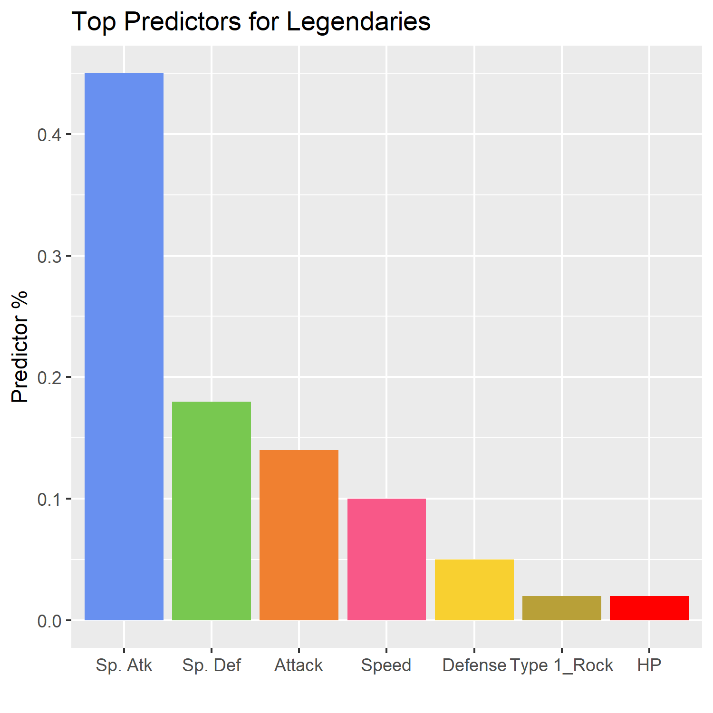

# Pokemon Legendariness Classifier

##### Collaborators:

|Name|github.com|
|----|----------|
|Rayce Rossum|[RayceRossum](https://github.com/RayceRossum) |
|Jack Yang| [jackattackyang](https://github.com/jackattackyang) |

## Objective
Pokemon is a popular franchise including games, TV shows and trading cards where trainers battle their Pokemon verses other trainers with the ultimate goal to "Catch 'em All". The climax of many of the games involves players rescuing and ultimately having a chance to capture a select class of extremely rare Pokemon known as the Legendaries.

The goal of this project is to determine the features that are most predictive of the legendary status of some of these most iconic, powerful and elusive Pokemon.

## Dataset

This dataset ["Pokemone with Stats"](https://www.kaggle.com/abcsds/pokemon/home) was found on Kaggle, released under CC0: Public Domain. The dataset contains Names of the Pokemon, type, various statistics such as attack, defense points... etc. as well as the legendary status (yes or no) of each Pokemon.

## Analysis

We used the decision tree classifier in Python's sklearn. We split our data into a features set that included stats and type of Pokemon, and a target set that included the Pokemon's legendary status. The DecisionTreeClassifier with a balanced weighting between the Legendaries and non-Legendaries was then used to generate our model. The object attribute `feature_importances_` returned an array of the features with the highest values which answered our question.



As we can see, (unsurprisingly) Special Moves tend to be very strong predictors for whether a Pokemon is Legendary.

## Report

Full report can be found [here](docs/Final_Report.md)

## Usage with Docker

1. Clone the [Repo](https://github.com/UBC-MDS/DSCI_522_Pokemon_Legendariness_Classifier)

2. ```docker pull raycer/dsci_522_pokemon_legendariness_classifier``` to retrieve the image

3.  a. Run the following commands from the shell to generate outputs:
  ```
  # docker run --rm -v "/path/to/project":"/project-dir/" dsci_522_pokemon_legendariness_classifier make -C "/project-dir/" all
  ```
  b. Alternatively

  ```# docker run -it --rm -v "/path/to/project":"/project-dir/" dsci_522_pokemon_classifier /bin/bash```<br/>
  ```# cd project-dir```<br/>
  ```# make all```

4. Alternatively run `run_all.sh` or individually:

  ```
  python src/1_pokemonData.py "./data/Pokemon.csv" "./data/Pokemon_clean.csv"
  Rscript src/2_pokemonEDA.R ./data/Pokemon_clean.csv ./results
  python src/3_pokemonAnalysis.py "./data/Pokemon_clean.csv" "./results"
  Rscript src/4_predictorsPlot.R ./results/DecisionTree_important_features.csv ./results
  Rscript -e "rmarkdown::render('./doc/Final_Report.Rmd')"
  ```

5. To clean analysis:
```
docker run --rm -v "/path/to/project":"/project-dir/" dsci_522_pokemon_legendariness_classifier make -C "/project-dir/" clean
```

## Usage without Docker

1. Install all the dependencies
2. Clone the [Repo](https://github.com/UBC-MDS/DSCI_522_Pokemon_Legendariness_Classifier)
3. Run `make all` in the command line or execute `run_all.sh`
4. To clean analysis run: `make clean`

## Dependencies

- R libraries
  - rmarkdown
  - knitr
  - tidyverse
  - maps
  - here

- Python libraries
  - matplotlib
  - numpy
  - seaborn
  - pandas
  - argparse
  - sklearn
