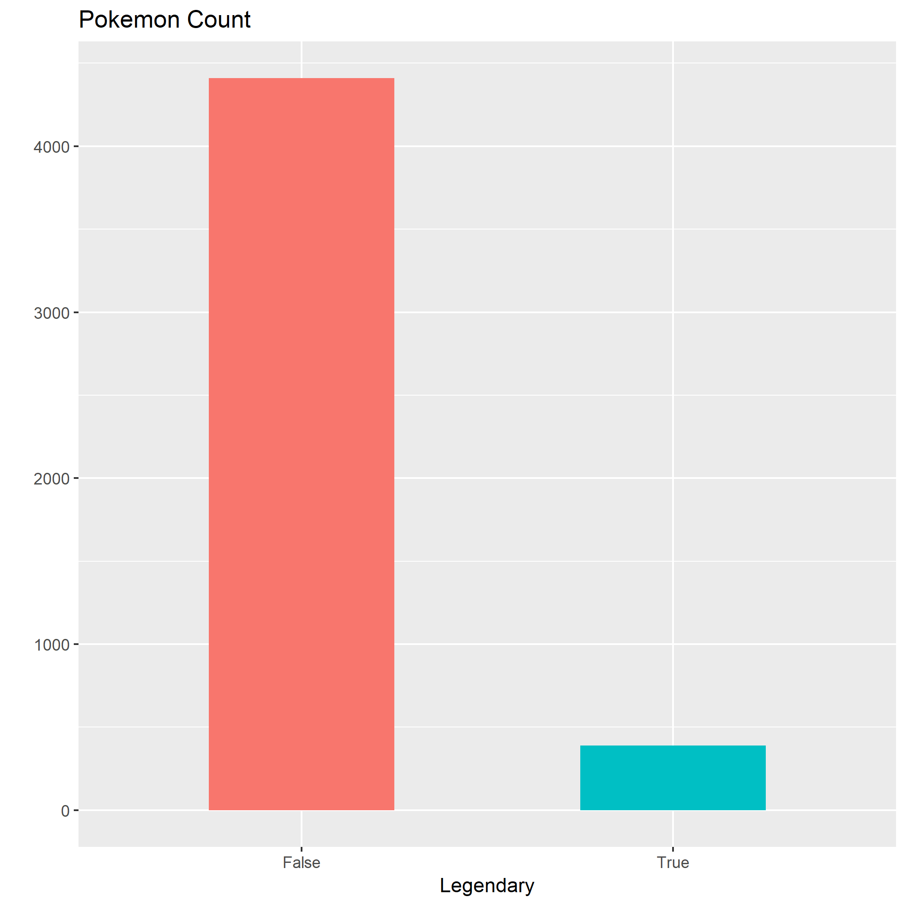
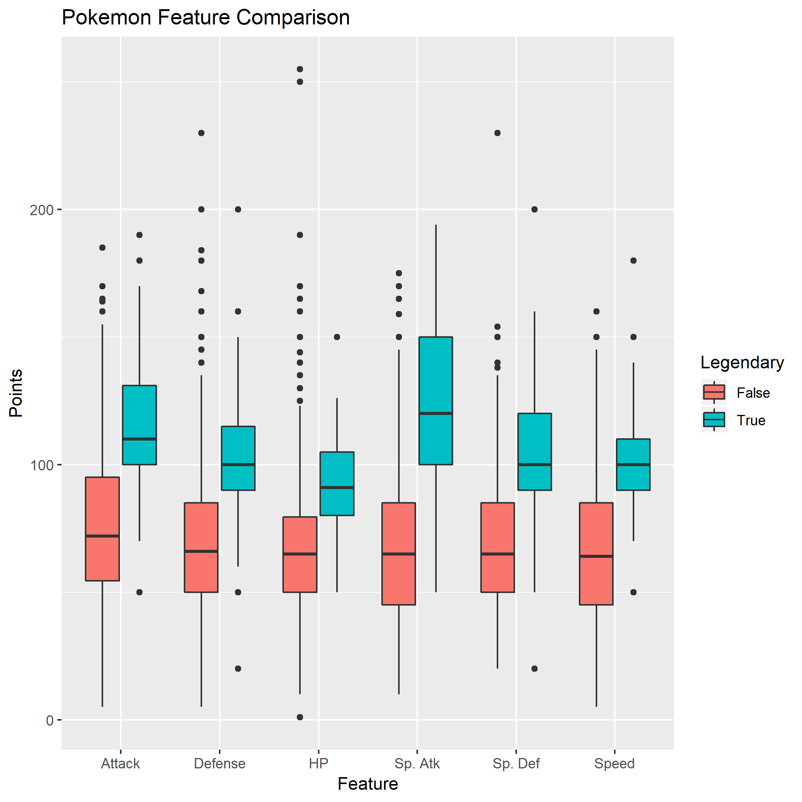
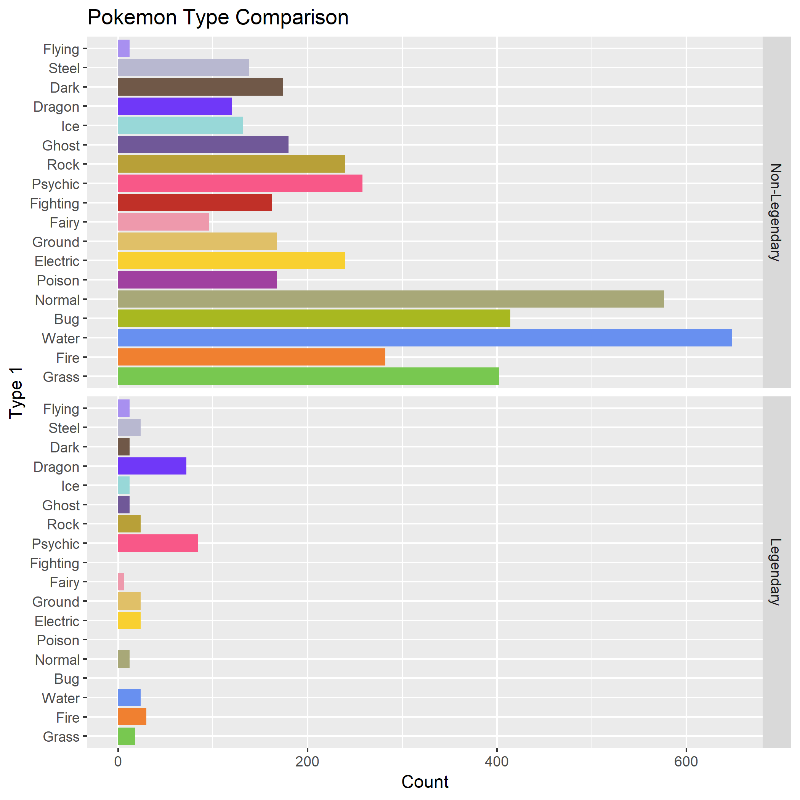

Pokemon Legendariness Classifier
================
Rayce Rossum, Jack Yang

## Introduction

This report documents our usage of a Pokemon stat dataset and
`sklearn`’s `DecisionTreeClassifier` to find the strongest indicators
of a Pokemon’s legendary status.

Pokemon is a popular franchise including games, TV shows and trading
cards where trainers battle their Pokemon verses other trainers with the
ultimate goal to “Catch ’em All”. Our dataset was created using
statistics from the Pokemon handheld games published by Nintendo which
classifies Pokemon based on stats (Attack, Defence, etc.) and Type (Bug,
Flying, Fire, etc.).

## Proposal Question

We are interested in the strongest indicators that determine whether a
Pokemon is legendary. This question is **Predictive** as we are using
existing Pokemon data to assess the attributes that are most indicative
of a legendary Pokemon.

## Procedure

#### Data Retrieval

We downloaded the [Pokemon
Dataset](https://www.kaggle.com/abcsds/pokemon)1 from Kaggle
and used the respective `read_csv` calls from R and Python.

#### Data Cleaning

We dropped “Generation” and “Total” from our set of features. “Total”
was dropped as it is a sum of all other stat variables and is not
independent, therefore it made no significant contribution to our
results. “Generation” was dropped as number of legendaries varies
between generations and we did not want the generation to influence our
decision tree.

#### Exploratory Data Analysis

The following barplot explores the dataset and gives us some intuition
of what proportion of Pokemon is actually legendary.

Figure 1: Pokemon Count

As we can see, less than 10 percent of Pokemon are legendary. This is
actually a little more than expected.

We are most curious in determining whether there is a relationship
between Pokemon attributes and the legendary status.

Figure 2: Pokemon Feature Comparison

We can see that indeed, legendary Pokemon tend to have higher stats
compared to regular Pokemon. Lastly, we wanted to see whether there is
any favoritism for legendary Pokemon across different types.

Figure 3: Pokemon Type Comparison

“Flying”, “Dragon” and “Psychic” types seem to take up a
disproportionate number of all legendaries, given their representation.
We would expect these types to play a role as legendary predictors.

#### Analysis

We used the decision tree classifier in Python’s sklearn. We split our
data into a features set that included stats and type of Pokemon, and a
target set that included the Pokemon’s legendary status. Type attributes
(categorical variables) for the Pokemon were split into columns
containing dummy variables due to the shortcomings of the `sklearn`
implementation of decision trees. The `DecisionTreeClassifier` was then
used to generate our model. We optimized our hyper parameter (depth) by
conducting cross validation. After selecting the most optimal depth, we
refitted the entire dataset. The object attribute `feature_importances_`
returned an array of the gini score reduction of each feature. The
features with the highest values answered our question.

#### Results

From our analysis, we found “Sp. Atk”, “Attack”, “Sp. Def” have the
greatest impact on determining the legendary status of Pokemon. Looking
back at our EDA we can see that “Sp. Atk” was the most outstanding
feature between non-legendary and legendary Pokemon so it makes sense
that this was chosen as the most important feature. Types had no
influence, which was surprising based on our EDA.

Table 1: Feature Importances

| Feature | Importance |
| :------ | ---------: |
| Sp. Atk |       0.53 |
| Attack  |       0.34 |
| Sp. Def |       0.13 |

Figure 4: Top Predictors for Legendaries

#### Limitations and Time Considerations

With our current knowledge level, between decision trees and KNN (k
nearest neighbors), we were more comfortable with classifying
categorical and numerical variables using decision trees. However, we
cannot say whether decision trees is better than KNN. These two may also
not be the best method for our question. Our views may change in a few
weeks from now with more techniques learned in Supervised Learning. An
interesting insight that we did not make use of in our analysis is the
fact that many legendary Pokemon are classified as “Genderless”. This
feature seems like a good indicator and warrants some exploration with
more time given to this study. Another limitation with this analysis is
the “pseudo-legendary”, a Pokemon with high stats that is not considered
legendary. In this case, our classifier would wrongly classify a normal
Pokemon as a legendary.

With more time available, we would like to test likely
mis-classifications, add a “Gender” feature and attempt to improve our
model by identifying better features.

#### References

###### 1: Pokemon Dataset

<https://www.kaggle.com/abcsds/pokemon>

###### 2: Pokemon Colour Templates

<https://bulbapedia.bulbagarden.net/wiki/Category:Type_color_templates>
